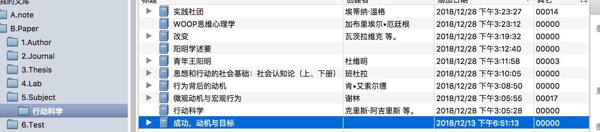

# 背景：

我们来开智学习，大都源于试图《改变》，学习之前，我们都会被洗脑「最小行动」，比如「卡片」就是最小承载体。  
而开智的强科学基因，不只是几条行动tips就简单完事，我印象里阳老师就很推崇过王阳明，WOOP理论(1#)等。  
我曾连续背单词两百多天，也试过不到一月学习一门编程语言，学了四门。但由于理论不够内化，我看阳老师文章已接近十年，16年算正式接触开智以来，知识输入层次提高了很多，行动依然欠缺。  
趁着学习信息分析，想改变这块，近期也看了类似《微习惯》之类的书，启发挺大，开始刷起了leetcode(2#)。有兴趣的小伙伴，欢迎一起来生成《行动科学》的全局认识。  
搜罗搜罗，已有一些关于行动的书，得结合论文，好好看看  

# 招募人背景：

段义波-北京-信息分析三期学员，三期写作学学员，开智部落第一期通识部落族长   
在百度做工程师，能写代码。经济学出身，知识面有一定的差异化。  
最近一次大改变，坚持生酮饮食方案，两个月瘦15斤  
可承担团队leader角色  

# 招募要求：

完成了学术部分的进阶作业；  
对此话题有内在兴趣；  
能够稳定提供时间进行共创。  
招募3-4人，团队太大往往效果不佳；  
懂得基础的github协作方法；  
此项目仓库[https://github.com/creativityHub/actionInsight](https://github.com/creativityHub/actionInsight)  
报名方法——在下面回复：  

# 个人信息；

对此项目的兴趣点；  
自己学术部分的进阶作业链接~  
github用户名  
承诺在结业周能够提供的时间。  

# 注释

WOOP理论：例子，if 今晚九点到家 then 背50个单词  
leetcode：工程师常用的面试算法题库。github地址 [https://github.com/dybwall1234/my_leetcode](https://github.com/dybwall1234/my_leetcode)

  

