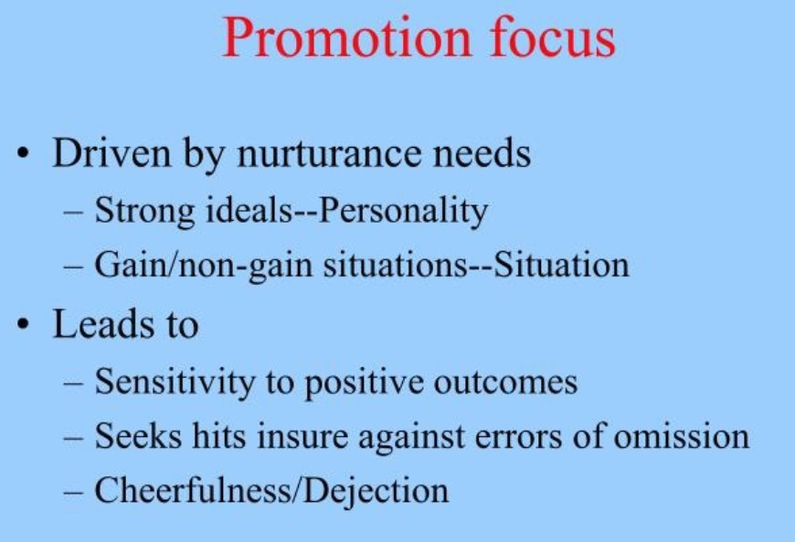
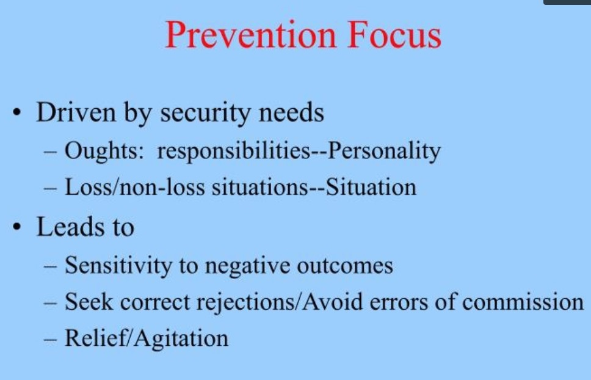

## 题目 大作业之行动指北 
## 摘要
### 问题
完成结业作业的行动科学指南。大作业是个不小的项目，需要团队协作，耗时长，任务重，加上每个人都还有本职工作等事情，要抽时间把事做好，需要应对的麻烦不少，那么怎么通过行动科学，更高效，不至于流产，输出某个课题的全局认识。  
## 目标  
结合行动科学，让我们更高效的完成大作业，激发更多人参与大作业。减少大作业的流产。
## 实践策略  
阳老师提醒：信息分析是在，问题定义 <=> 数据来源 两者之间不断循环。在问题的界定、数据的收集上要表现出足够的【灵活性】。要理解，一切问题的界定都是可以随时推翻的；一切数据都存在不同的解决角度、反对角度。    
1，行动科学初探  
尝试过从《行动科学》Agyris出发，搜索相关师承，引用关系，发现内容较少。行动科学是个跨学科课题，学术渊源复杂，而经验性的知识，其实我们每个人都有。 
简便起见，与大作业相关的主题，主要有目标，计划，行动，动力，动机，意图，自制力，意志力，自我监控，自我效能，执行意图，习惯，拖延，行动瘫痪等  
2，界定大作业课题中所涉关键理论，进行大作业阶段拆分，寻找各个阶段中行动的理论支持和实践策略  
问卷调查，大作业最关键步骤与坑，开会反复进行讨论和寻找理论支持，确定各环节可用理论和实践策略。然后主要使用《成功，动机与目标》里的主题词进行对应。  
3，提炼关键矛盾，输出关键理论和实践策略。  
回到关键问题，发现最关键的理论是Argyris的双环学习，涉及到行动的主要是动机学领域的Deci的自我决定论，动机学引用排第三的刚好是发布防御性目标和进取型目标的E. Tory Higgins。然后目标与监控，则主要是Goal-setting theory领域的Edwin A. Locke。团队学习方面则依然是Argyris的MODEL II  
重要经验就是，演绎真的很难，很多领域的资料断裂很严重，得从实际问题分解，从一个个case对应起，再做提炼。  

## 关键理论 
1，行动科学  
Kurt Lewin, first coined the term "action research" in 1944。
《Action Research and Minority Problems》
他定义行动科学是A circle of planning, action, and fact-finding about the result of the action。   
而后主要被Chris Arygyris承接，Arygyris核心两个理论，双环学习，MODEL II被广泛使用，《成功，动机与目标》下面简称《成功》和《第五项修炼》也引用到。  

图1，单环学习和双环学习  

主要区别是，如果结果不如预期，单环主要是反思行动策略，进行改进。而双环会重新框定情境，例如信念，环境等因素。  例子 北京咳  有趣点

图2，Models I and II   
 
专家更容易陷入单项学习。本以为技术高超的专业人员更善于双环学习，但实际上他们都很善于“单环”式的学习。  
毕竟，他们花费 了大量时间去获取学位证书，精通一门或多门专业，并应用专业知识来 解决实际问题。然而，具有讽刺意味的是，正是这个原因导致了专业人 员不善于“双环”式学习。
简单地说，因为许多专业人员都在其所从事的领域取得了成功，很 少有失败的经历，所以一旦他们的单环学习方式出了问题，他们就变得 充满防卫性，排斥批评意见，把责任推给其他人。一句话，他们的学习 能力在最需要的时候消失了。  

图3，Deci的自我决定论   


图4，Locke的Goal-setting theory，上面模型里都没有明确提到目标设定，搜索motivation action theory看到论文《Building a practically useful theory of goal setting and task motivation》，真是想要的，填补了空白。  有趣点  


那么跟我们大作业相关的核心问题：  
1，我们怎么计划，行动和进行结果验证。        
2，结果不如预期时，我们该怎么办，到底是使用新的目标，计划和行动方案，还是对情境或者对自我进行重新认识。   
3，如何团队学习，生产集体智慧。  


### 大作业时间拆分  
#### 选题组队  
1，意义镀金术，做大作业，想象它的意义，比如通过同侪互助，把信息分析知识内隐化。  
  
2，畏难情绪，进步型目标   
  

 
#### 从目标与计划说起，不论团队还是一个人，都很重要。  
Deci说，我们的基本需求是自主，胜任，归属。这些需求也就是促使我们行动的主要动机。 
反行为，不同于反常识，反常识是认知常识，反行为指的是行为常规，你知道但做不到的。    
1，Locke表示目标需要具体化，「减掉5磅」比「减点儿肥」更好，知道具体做到什么能让你保持动力。必要的难度，增强你的动力。  

2，需要做好计划。动机学表明计划是战胜目标破坏因素最重要的工具。  
常见的目标破坏者有，错过时机，目标竞争导致的拖延等。
实践策略：Peter Gollwitzer提出了简单计划，强大力量的执行意图，也就是if。。。then。。。模式，例如「如果晚上九点到家，我就背50个单词」。这种执行方式，调用你的潜意识，结合一些触发点的使用，类似桌前写个小卡片，让环境提示你。减少意志力的消耗。  

3，心理对照  
执行意图的作者和《成功动机目标》作者H Grant与奥丁根提出了心里对照。加布里埃尔·奥丁根大量研究了“相信自己能成功”与“相信自己能轻而易举成功”这两种不同信念对动力所产生的不同影响，屡次发现它们对成功起着极为不同的作用。  
对结果的想象：乐观有利于实现目标  
对过程的想象：悲观有利于实现目标  
指人们在思维过程中首先想象目标实现后的收获,然后思考现实中阻碍实现目标的因素,通过对比目标实现后的收获和现实中的障碍,使未来和现实同时通达,在未来和现实之间建立起心理联结,激活个体达成目标（成功）的期望。心理对照策略不仅能够改变人们的认知和动机,还能够改变个体对于消极反馈的反应。  

4，Locke表示目标的反馈和监控很重要。避免拼搏于无效的道路上，需要反馈机制，如果反馈不到位，有意识的review就很重要。详细说明参照《Building a Practically Useful Theory of Goal Setting and Task Motivation》  

#### 一些关于执行的问题  
高效执行，我们需要注意的。 
1，动力层面，增强自主性，拥有选择和自主权，自我驱动力就越大。  
2，工具简单，规范简洁。减少工具知识缺乏导致时间预估上的认知偏差，过度紧迫。如果团队协作，推荐github和zotero，github甚至可以主要用到issue。   
模板是很重要的，不能忽略低智学习的重要性。     
3，固定时间review进度。  
4，目标冲突   
《成功》那本书给的建议是，放弃某个目标，或者轮流执行。可以把任务分批，同类型的事务放在一起。      
5，复杂问题    
人天生喜欢追问为什么，但我们大脑资源有限，工作记忆有限，可能导致过度归纳，形成偏见，并不利于问题的求解。  
要想办法把问题拆解，针对具体实际的问题输出卡片，表格等。输出同时是做了认知卸载。然后通过卡片再做启发性思考。  
另外一种说法就是进行防御性思维    


Tory Higgins研究发现使用防御性思维，把「为什么」切换为「是什么」思维。关注具体细节，问题分解后，更利于求解。  
我们需要对事务分批，分清楚哪些事务是需要消耗大量脑力的，哪些只是需要执行的，尽量把任务分解成可简单执行的。例如使用执行意图，比如每天至少完成三张卡片。    
6，不轻易言弃   
**放弃的难度**，想象时间成本，自我效能等因素，刚开始你觉得后面大不了放弃，中途你真的能安心放弃吗。当然必须放弃的话还是得放弃的，这里主要是一个提示，既然要做中途别随便就想到放弃。要放弃也需要干净利索。    

#### 集体智慧生成
很多时候，我们要执行的任务是需要集体智慧不断碰撞的，那么基于MODEL II和及其衍生的《第五项修炼》简单说说。  
2.1  团队学习  
《第五项修炼》里提到团队学习必须精于深度会谈(dialogue)，出自于美國量子物理學家戴維·伯姆（Bohm．D）的的《論對話》。  
深度会谈是一种共同意义的汇集。超越个人认知，也不是简单汇总。
深度会谈，有三个必要条件：
1，所有参与者必须将他们的假设「悬挂」在面前。  
2，所有参与者必须视彼此为工作伙伴。  
3，必须有一位「辅导者」来掌握精义和架构。  
这一套理论其实跟model II基本映照。  
下面详细说明：  
2.1.1 悬挂假设和伙伴关系  
有意识觉察和检验我们自己的假设。   
实践策略：开会前提交自己进展，会中交叉讲解别人进展。以便个人知识进行流通，也为后面知识整合打下基础。  
呈现结论生成过程，接受问询，是传递个人收获的必要手段。也能很好的避免交流不畅导致的组员行动拖延，或者私自行动。  

2.1.2 辅导者主要是协调和处理分歧   
1，要让每个人感受到尊重，每个人都有参与感，能参与决策，满足每个人对自主性的需求。不然可能导致组员放弃悬挂假设。  
2，别以专家角色出现，避免组员过度关注辅导员。  
3，保持会谈质量，会谈是为了发现新看法。     
如果团队已经养成深度会谈的习惯，则可以不再需要辅导者。如果没人做辅导者的话，发起者要有意识去承担这个角色。    

#### 路演  
写好逐字稿，声音最好的讲，全体参与答疑。多用交叉图表表，简洁直观，方便对比。配色舒服。  
意图调整，自信，尊重，专注，enjoy。时间限制下的心理调节。
接近性目标：
回避性目标：
不被打扰，熟悉，安静的环境，最好是家里。还有就是可能前面演讲团队形成的压力，需要注意下，到自己了，自己就是主场。  
预演，全屏时忽略聊天框的闪动，手机关闭自动锁定，方便看时间。  
带上鼠标，操作便捷。带上笔，方便标记，ipad方便看文稿。      

## 输出清单 
清单为何重要，因为你不知道你的认知焦点会怎么变化，过段时间你会忽略什么。   
### 团队规范清单：  
模板：  
进度模板.md  
```## 摘要  
    ## item1  
    摘要：  
    源链接：  
    ## item2  ```

meeting-note.md：  
```## 摘要  
    时间：  
    地点：  
    主要信息：  
    ## 信息点  
    ## 行动点  
    ## 疑问点  ```

### 每日行动清单：
会前：
1, 每天至少完成三个卡片，并会前提交。  
2, 准备要讨论的课题    
3, 准备要加进todolist的议题   

会中:
1, 交叉复述别人的进展  
2, 讨论接下来要做的条目  
3, 项目进度回顾  

会后:  
更新会议纪要  
更新todolist  

### 行动阻碍因素自检清单 TODO 列出所有行动障碍 并举例
mental contrasting  
be-good vs get-better  
promotion vs prevention    
if...then... list    
最小行动卡片  
计划和监控  

## 参考资料  
《行动科学》  
《成功，动机与目标》  
《第五项修炼》  
action research resource：http://www.aral.com.au/resources/  

## changelog  
20190117 初稿  
20190118 v1.0  
20190120 v1.1  


