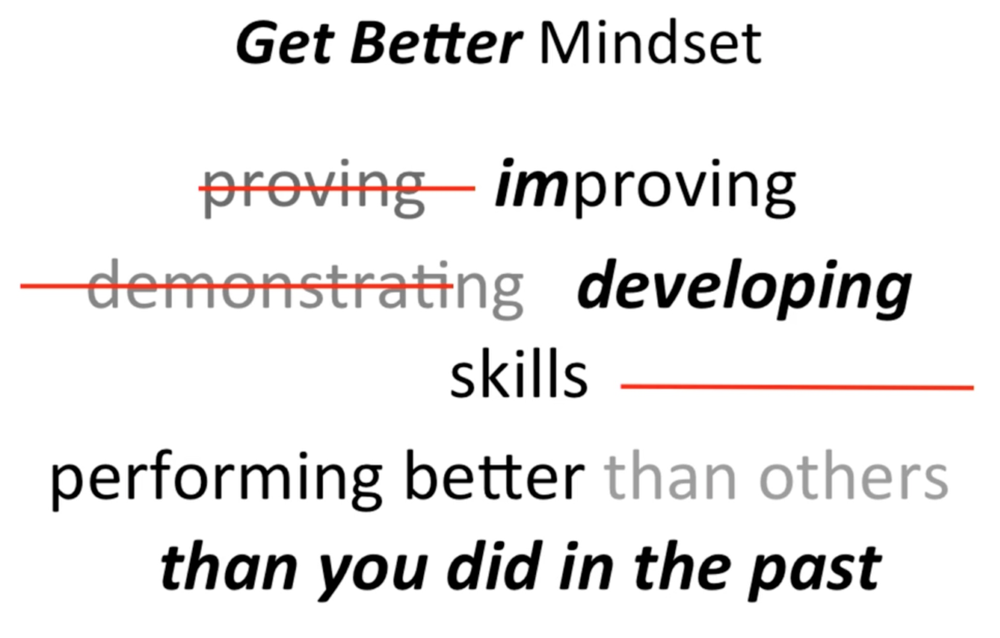
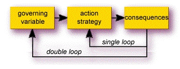
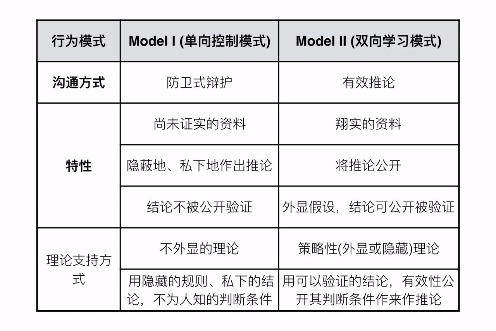

# 
动机学Google学术排第三的E. Tory Higgins的论文 Promotion and prevention: Regulatory focus as a motivational principle

进步性目标

 「项目名」大作业之行动科学指南

- 路演时间：7wd3
- 路演方式：参与
- 项目名称：大作业之行动科学指南
- 项目摘要：结合行动科学，让我们更高效的完成大作业
- 项目封面：制作一张封面配图，迅速抓住观众注意力
- 项目仓库：https://github.com/creativityHub/actionInsight
- 最终作品：https://www.jianguoyun.com/p/DRRUXv0Q09GfBxiSv5kB 未完成，后续更新
   - 信息报告：建议上传 pdf 版本
   - 演示幻灯：上传至百度云盘，方便课程组汇总备份
- 团队成员介绍
   - 段义波 组长，决策和引导  
   - 升升-北京：-信息分析二期、三期，六期写作，开智部落二期通识部落，py104学员。在银行做软件测试。  
   - 宋明迅-杭州：行动力不强，是个人成长领域的痛点，这个方向有比较大的研究价值和实用价值。  
   - 张弘-成都：目前正在母子茶修系列课程中，实践行动方法在个人成长领域的应用，想了解行动科学领域的演变过程。  

