# 如果你也有朝一日想要开一个书店——书店行业全局认识

开智学堂信息分析课程第二期结业项目

BP下载链接: [https://pan.baidu.com/s/1SR3S0N60koOts69R44GaZw](https://pan.baidu.com/s/1SR3S0N60koOts69R44GaZw) 提取码: pe8c

作者：张太阳、丁超、大太阳

## 目录

0.摘要

1.背景

2.分析过程

3.书店行业的全局认识

* 3.1 时间

* 3.1.1 书店的起源

* 3.1.2 书店的发展

* 3.1.3 书店未来发展趋势

* 3.2 空间

    * 3.2.1 各城市实体书店数量对比
    * 3.2.2 国内外实体书店数量对比（待补充）
* 3.3 变量

    * 3.3.1 政府政策
    * 3.3.2 图书出版行业
    * 3.3.3 图书零售行业
* 3.4 彩蛋

4.对一家书店的全局认识

* 4.1 从几家头部连锁书店说起

    * 4.1.1 西西弗书店
    * 4.1.2 言几又书店
    * 4.1.3 先锋书店
    * 4.1.4 茑屋书店
        * 4.1.5 亚马逊线下书店
* 4.2 不忍错过的独立书店

    * 4.2.1 两本书店
    * 4.2.4 冈森书店
    * 4.2.5 亚马逊无人书店
* 4.3 如何建立对一家书店的全局认识

    * 时间
    * 空间
    * 变量
        * 赢利点

5.书店的盈利模式和战略指数在哪里

* 5.1 书店有哪些盈利模式？
* 5.2 书店有哪些战略指数
* 5.3 发现洞察：开书店的机会在哪里

6.报告的结尾

* 6.1 插入一个硬广——「一个书店」
* 6.2 心得与收获
* 6.3 商业与情怀
* 6.4 如果你也想有朝一日开一个书店

## 0.摘要

这是开智学堂「信息分析」课程大作业项目《如果你也有朝一日想开一个书店》，我和小组成员丁超、太阳就“书店行业全局认识”这一话题展开了信息搜索、信息整理、信息分析等工作。

在搜集和分析信息后，我们发现了一些关于开书店的洞察。比如，与现在连锁书店越开越大的现象相反，我们认为书店不应做“购物中心大卖场”，而应做“社区读书便利店”；比如，不靠买书赚钱，不等于不做书的生意；比如，“会员制书店”还不够，要变成“朋友制书店”等等。

此报告对项目工作成果进行阐述，主要内容围绕“书店行业的全局认识”、“对典型书店的全局认识”、“书店的盈利模式和战略指数”、“开书店还有哪些机会”、“开书店小工具”等。在搜集过程中仍有很多重要信息没有找到，结论也有很多不够成熟，期待与你进一步讨论和迭代。

## 1.背景

或许每个爱看书、爱书店的人都有一个梦想：就是有朝一日开一家属于自己的书店。无论是连锁书店还是独立书店，无数书店人都面临的问题：在这个离钱很远的行业里如何盈利？如何养活自己的店？如何拥有良好的商业模式，而不是用“情怀”发电？书店行业有哪些反常识？开书店应该看的第一份全局信息报告，给五个月前的自己和未来的大家。

## 2.分析过程

* 列出第一版书店行业全局认识的思维脑图并初步分工
* 在按照行业维度去搜集资料的过程中发现没有方向并且信息比较片段
* 讨论后修改方向为从单个书店入手调研，同时整理分析一家书店的全局认识需要考虑哪些维度。列出一个大表格，将搜集到的各个书店资料放到表格里，以结构化信息。
* 看《发现利润区》《下一代书店》《知的资本论》等书，找到需着重解决的问题：书店的盈利模式和战略指数。
* 在分析的这段时间内参加了杭州书店探店和北京书萌聚会，从实地和书店人出版人出获得许多信息和灵感。
* 经大作业线上分享同学提醒，发现过度陷入细节中，因此转而进行信息分析并发现洞察。
* 制作信息分析报告和keynote，并不断发现可迭代的点。

## 3.书店行业的全局认识

### 3.1 时间

* 书店的起源

    根据知网文献显示，陈文豪、林应麟二位作者认为书肆最早产生于春秋战国时期，早于“书肆”的文字记录。“书肆”之名，最早见于西汉扬雄(公元前53年至公元18年)《法言·吾子》：“好书而不要诸仲尼，书肆也”。这一记载也为我们留下了关于书肆起源的最早记载。

    书店古称“书肆”、“书坊”、“书铺”，或称“经籍铺”，既销售图书又刻印书籍，发行和出版两位一体。

* 书店在各历史阶段中的发展

    * 1978-1985:爆发式增长

        1978年十一届三中全会之后，由于市场大量空缺，实体书店如雨后春笋般诞生。

        1985年对比1977年，图书种类增长了254%，总印张增长了140%，总印数增长了102%。

    * 1986-1994:缓冲期

        在经历急剧成长的时期之后，书店行业快速新生成长的势头暂缓。

        1986年，图书出版总量大跌，总印数比1985年下降22.08%，总印张数下降22.03%，之后直到1993年，图书出版总量仍然未超过1985年的最高点。1994年，图书出版总印数达到297.16亿印张，首次超过1985年282.75亿印张。但出版总印数60.08亿册（张）仍然低于1985年66.73亿册（张）。

    * 1995-2002:平稳增长期

    ```
    经历了迅速成长和刹车式缓冲期，之后这段时期传统书店行业的生命力其实在减弱。

    但由于经济发展的东风，民营书店增多，书店行业经历过一段总体平稳增长期。然而由于书店的自身发展动力不足和运营机制的欠缺，这段时期印刷数量和图书种类都在不断增长，销量却停滞不前，市场上图书同质化严重，替代产品繁多，盗版也越来越猖獗，图书库存金额直线上升，资金周转越来越紧张。总体上，书店以“一半挣钱一半情怀”的状态在经营，可以盈利但是盈利水平较低。

    ```

    * 2002-2012:寒冬来临，书店倒闭潮

    大约从2002年到2012年，尤其是2011年之后，民营书店出现大面积倒闭潮。

    大多数书店连“一半挣钱”的状态都没有了，要不在靠着情怀死撑，要不直接关门大吉。北京“第三极”“风入松”“光合作用”等著名人文书店接踵倒闭，鼎盛时有8家门店的上海季风书园，只剩总店苦苦支撑。据全国工商联书业商会调查数据，全国有近五成的实体书店倒闭，总数达1万多家。

    房租、盗版、电商成为实体书店身上的最大压力。尤其是互联网带来的折扣售书及数字阅读，使实体书店图书销售量以年均10%的速度下降。2014年，当当、京东、亚马逊线上售书124亿元，超过了全国127家大型书城。房租和人工成本的高涨，加上税收，以及网络碎片化阅读带来阅读方式的改变都给实体书店带来很大冲击。

    * 2013-2016:悄然回暖

        2013年，政策宣布免征图书批发、零售环节增值税。保卫实体书店不再是呼声，而是有了政策落实。

        2014年，实体书店图书销售数量和销售额实现了3%以上的增长，增长率超过了网上书店。三联24小时书店纯图书销售2055万元，同比增长58%。与此同时，一些地标性书店经营复苏，先锋书店、钟书阁等不断开出新店，方所、言几又等新式连锁书店落地，实体书店悄然回暖。

    * 2017-:破壳新生

        一部分是传统书店力挽狂澜顺应潮流改革，一部分是特色民营书店逐渐扩大影响力。但是由于2017年新消费新零售的呼声高涨，这类新生书店终于不再是属于文艺青年的小众文化，而是华丽转身成为体验式消费代表走到台前，所以姑且将2017年视为分水岭来描述这类即将崛起新式书店。

    **开卷实体书店指数在正常波动范围，但8月环比、同比较往年降幅较大。**

2018年8月，开卷实体书店指数为293.2，比2018年7月下降了126.68个点，环比下降了30.17%，同比下降了9.8%。

[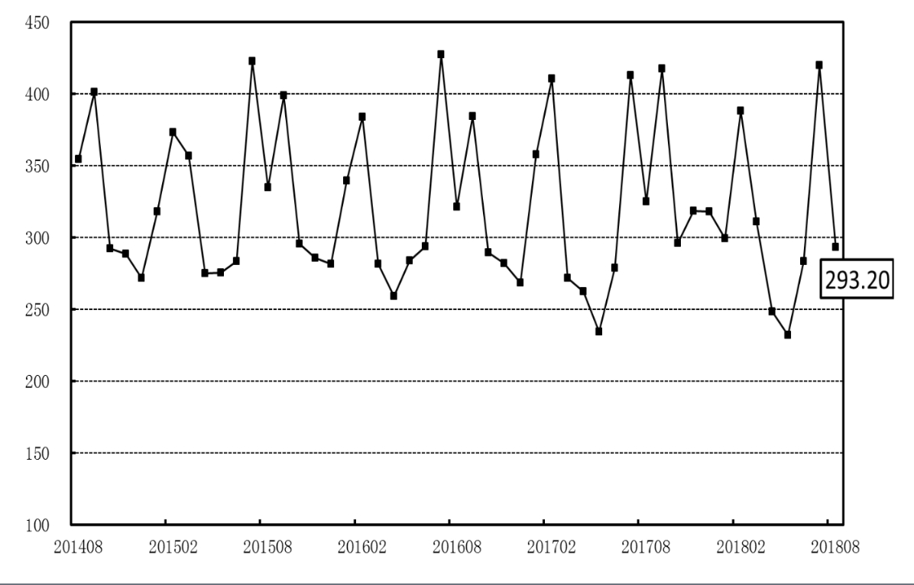](media/68747470733a2f2f7773312e73696e61696d672e636e2f6c617267652f303037394a593854677931667862386862686f76766a33307838306c617463352e6a7067.)
[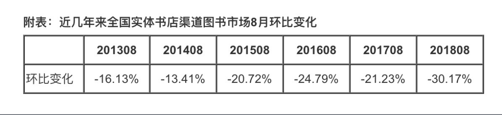](media/68747470733a2f2f7773312e73696e61696d672e636e2f6c617267652f303037394a593854677931667862386970396b6e736a3330783830376f6162652e6a7067.)
[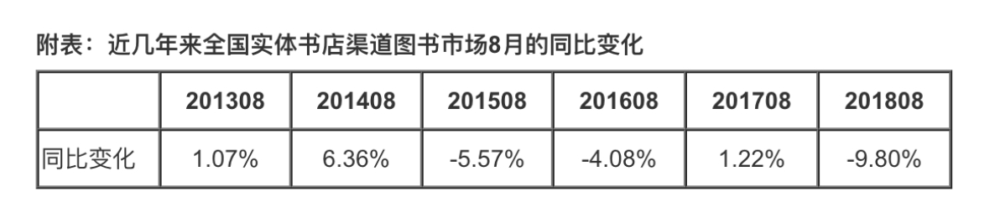](media/68747470733a2f2f7773312e73696e61696d672e636e2f6c617267652f303037394a593854677931667862386a6e70336b6c6a333078343037657134392e6a7067.)

从全国实体书店渠道五大地区来看，与2018年7月相比，五大地区均表现为环比下降。与2017年8月相比，中南地区同比上升，其余四大地区表现为同比下降。

[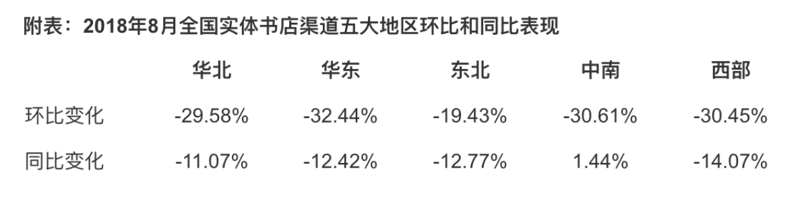](media/68747470733a2f2f7773312e73696e61696d672e636e2f6c617267652f303037394a593854677931667862386c613739787a6a33307838303873676e362e6a7067.)

* 3.1.3 书店未来发展趋势

    亚马逊无人店？新零售？
    电子阅读和线下阅读的融合、多业态融合、小众书店联盟？

### 3.2 空间

* **3.2.1 各城市实体书店数量对比**

    在榜单前十位中，大连和南通为仅有的两座GDP未突破千亿的城市。在经济总量并不十分突出的情况下，两座城市的书店绝对量排名全国前列，显示了两地在文化消费领域的偏好性。

[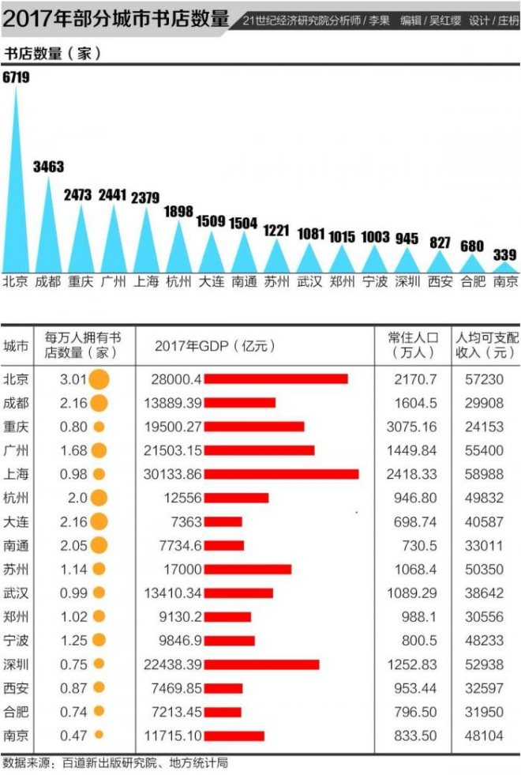](media/687474703a2f2f696d616765312e61736b63692e636f6d2f696d616765732f323031382f30382f33302f63303662643232613136373666303339393766313630346561653762386565632e6a7067.)

**2017中国城市人口数量排行榜**

| 排名 | 城市或地区 | 人口 （万人） | [GDP](https://www.phb123.com/city/GDP/) （亿元） | 人均GDP （元/人） |
| --- | --- | --- | --- | --- |
| 1 | 重庆市 | 2884.62 | 7894.24 | 27367 |
| 2 | 上海市 | 2301.91 | 16872.42 | 73297 |
| 3 | 北京市 | 1961.24 | 13777.9 | 70251 |
| 4 | 成都市 | 1404.76 | 5551.3 | 39518 |
| 5 | 天津市 | 1293.82 | 9108.83 | 70402 |
| 6 | 广州市 | 1270.08 | 10604.48 | 83495 |
| 7 | 保定市 | 1119.44 | 2050.3 | 18315 |
| 8 | 哈尔滨市 | 1063.6 | 3665.9 | 34467 |
| 9 | 苏州市 | 1046.6 | 9000 | 85993 |
| 10 | 深圳市 | 1035.79 | 9510.91 | 91822 |
| 11 | 南阳市 | 1026.3 | 1955.84 | 19057 |
| 12 | 石家庄市 | 1016.38 | 3401 | 33462 |
| 13 | 临沂市 | 1003.94 | 2400 | 23906 |
| 14 | 武汉市 | 978.54 | 5515.76 | 56367 |
| 15 | 邯郸市 | 917.47 | 2342.2 | 25529 |
| 16 | 温州市 | 912.21 | 2925.57 | 32071 |
| 17 | 潍坊市 | 908.62 | 3090.9 | 34018 |
| 18 | 周口市 | 895.32 | 1227.9 | 13715 |
| 19 | 青岛市 | 871.51 | 5666.19 | 65016 |

一般常识是收入越高的城市，人均拥有书店数量越多，但除了北京、广州以外，成都、大连、杭州、南通都遥遥领先，成都是闻名的休闲城市，这一数字高的理所当然，其它三个城市是宜居城市，所以城市环境及文化的影响，与人们喜欢逛实体书店有一定关系。

2017年，实体书店在一线城市和重点二线城市大幅回暖。统计数据显示，一线城市北京、 上海、 深圳、 广州分别拥有824家、842家、491家和734家实体书店，共2891家， 其中新开业书店有392家， 占比 13.56％ 。

## [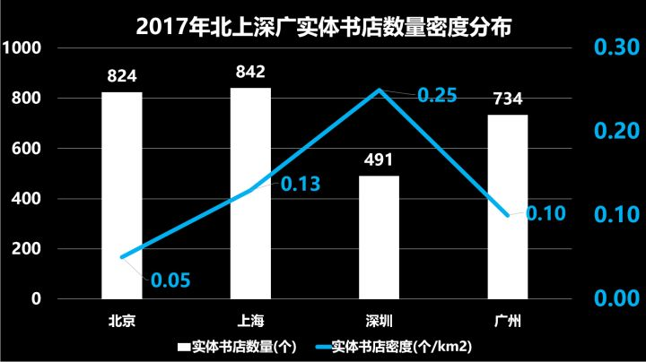](media/68747470733a2f2f706963312e7a68696d672e636f6d2f38302f76322d63336361376661383839386138656366333237306366353063366237376161345f68642e6a7067.)

### 3.3 变量

* **3.3.1 政府政策**

**2015年起北京市政府持续对实体书店进行资金扶持，并且力度逐年加大**

| 城市 | 年份 | 扶持资金预算 | 实际扶持书店数量 |
| --- | --- | --- | --- |
| 北京市 | 2015年 | 600w | 56家 |
| 北京市 | 2016年 | 1800w | 71家 |
| 北京市 | 2017年 | 1800w | 71家 |
| 北京市 | 2018年 | 5000w | 151家 |
| 北京市 | 2019年 | 预计1个亿 |  |

**扶持资金支持方式**

（一）补贴。对符合功能定位和区域布局的特色书店和社区书店给予房屋租金补贴。

（二）奖励。对实体书店创新经营模式、实现多业态融合发展予以奖励。

（三）政府购买服务。对实体书店在传播党的方针政策、弘扬社会主义核心价值观、开展公益性文化活动和提供公共文化服务等方面，通过政府购买服务方式给予支持。
数据来源：北京市新闻出版广电局

**典型案例 三联**：创立于1996年的三联书店，自2013年起，分三批共获得来自中央财政900万元的文化产业专项资金支持，这些钱主要用于扩大营业项目和规模。“2013年我们收到了两个利好，为书店的经营奠定了发展基础。”三联韬奋书店总经理张作珍介绍说，当年12月，财政部文资办通过北京市出版局拨给三联书店第一笔100万元试点单位奖励资金。同月，国家出台了减免图书增值税的政策。得益于这两个利好，三联书店在2014年2月筹建了24小时书店。 “2014年，三联书店又获得了两笔国家扶持资金。”张作珍说，一笔是作为全国扶持实体书店试点单位，财政部文资办通过北京出版局给书店拨了200万元。另外，书店利用筹建海淀分店项目向财政部文资办提交报告，从中央文资办拨给中国出版集团的文化发展基金中获得了600万元专项资金，金额相当于三联书店海淀分店开业先期投入资金的2/3。放眼全国，还有哪些实体书店能像三联书店这样幸运？国家新闻出版广电总局印刷发行司司长王岩镔在谈到扶持书店选取标准时说，不仅规模大的书城有优势，小的有特色的书店也会被选中，关键是社会知名度和品牌影响力。杭州文化坐标晓风书屋的主人姜爱军说，晓风书屋被选中就是因为其在当地的文化影响力。北京纸老虎书店、上海季风书园、广州学而优等民营书店也名列其中。在2013年第一批试点的56家书店中，民营书店约占受资助书店总数的1/4。

**其他各国政策**

[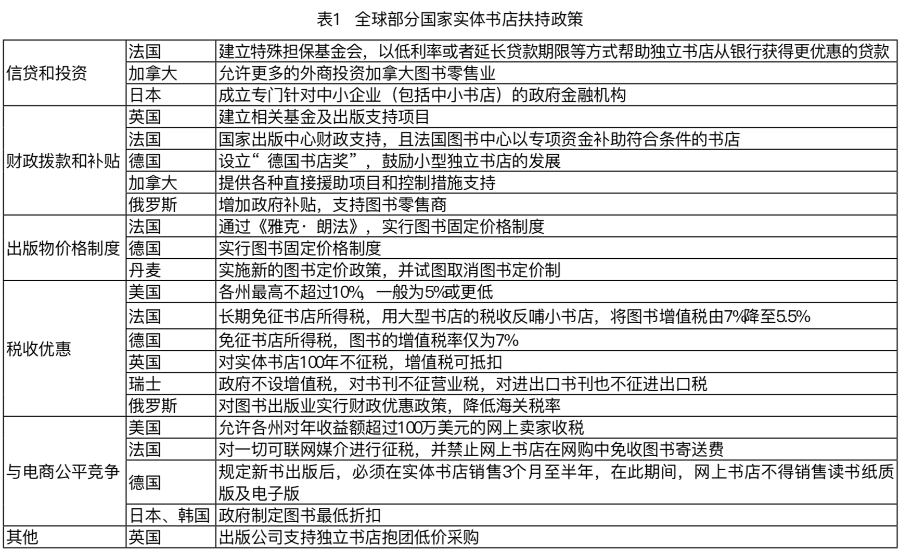](media/68747470733a2f2f7773312e73696e61696d672e636e2f6c617267652f303037394a593854677931667838716a77757a35716a333163303074733768762e6a7067.)

附件：《北京市2018年实体书店扶持项目特色书店入围名单》、《北京市2018年实体书店扶持项目社区书店入围名单》、

[《北京市实体书店扶持资金管理办法》](http://xwgdj.beijing.gov.cn/zwxx/tzgg/201810/t20181016_5133.html)、

[《市新闻出版广电局召开实体书店扶持工作征集动员会》](http://xwgdj.beijing.gov.cn/zwxx/gzdt/201807/t20180718_4773.html)

### 3.3.2 图书零售市场

**2018年国内图书零售市场继续增长，但上半年增速放缓。**

[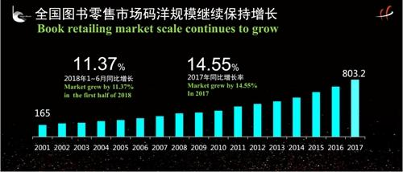](media/687474703a2f2f7777772e78696e6875616e65742e636f6d2f626f6f6b2f323031382d30382f32322f3132393933373339395f31353334383937333538383133316e2e6a7067.)[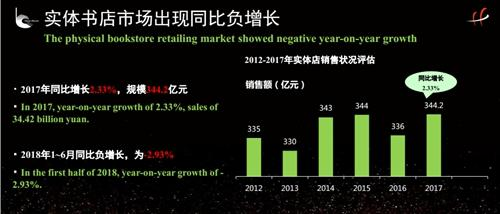](media/687474703a2f2f7777772e78696e6875616e65742e636f6d2f626f6f6b2f323031382d30382f32322f3132393933373339395f31353334383937333538383432316e2e6a7067.)

《中国图书零售市场半年度数据报告(2018)》显示，2018年上半年全国图书零售市场的增幅有所回落，但仍在10%以上，其中实体书店市场2017年转为正增长，但是2018年上半年又转为负增长，为-2.93%。

此前，《2017年中国图书零售市场报告》显示，2007年到2017年，整个图书零售市场稳步增长。2017年中国图书零售市场总规模达到803.2亿元，同比增加14.55%。网上书店渠道依然是市场增长的主要推动力，实现了25.82%的增长，2017年达到了411亿元，占比51.2%，其中第三方平台业务是网上书店中规模较大部分。

2018年图收销售上半年同比增长11.37%，增幅有所回落，但仍在10%以上。

**实体书店销售增幅缓慢，网络书店于2016年超过实体书店，近五年市场规模如下**

[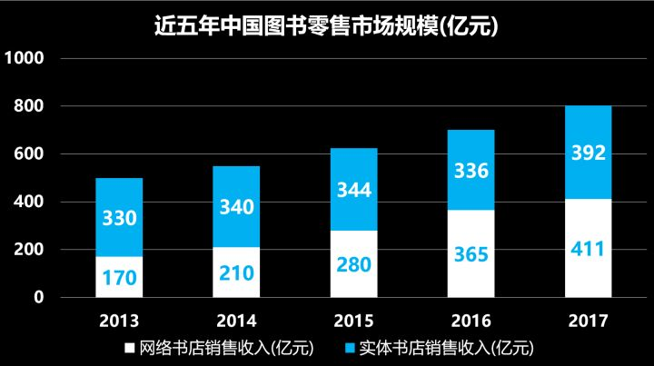](media/68747470733a2f2f706963332e7a68696d672e636f6d2f38302f76322d30636462373066633439303831373162633666333838346266363139326633365f68642e6a7067.)

**在图书销售市场上，重要的主力军是少儿图书。**

2017年图书零售市场的增长有三分之一以上是来自于少儿类图书，占到图书零售市场的码洋比重达25.5%，2018年这一比例已达到26.25%。

[](media/68747470733a2f2f706963332e7a68696d672e636f6d2f38302f76322d35623833336634633938616263636539633865333233613533326661393061365f68642e6a7067.)

### 3.3.3 图书出版市场

**2016年中国及全球主要国家纸质书年度增长率比较，我国增长率可观。**

[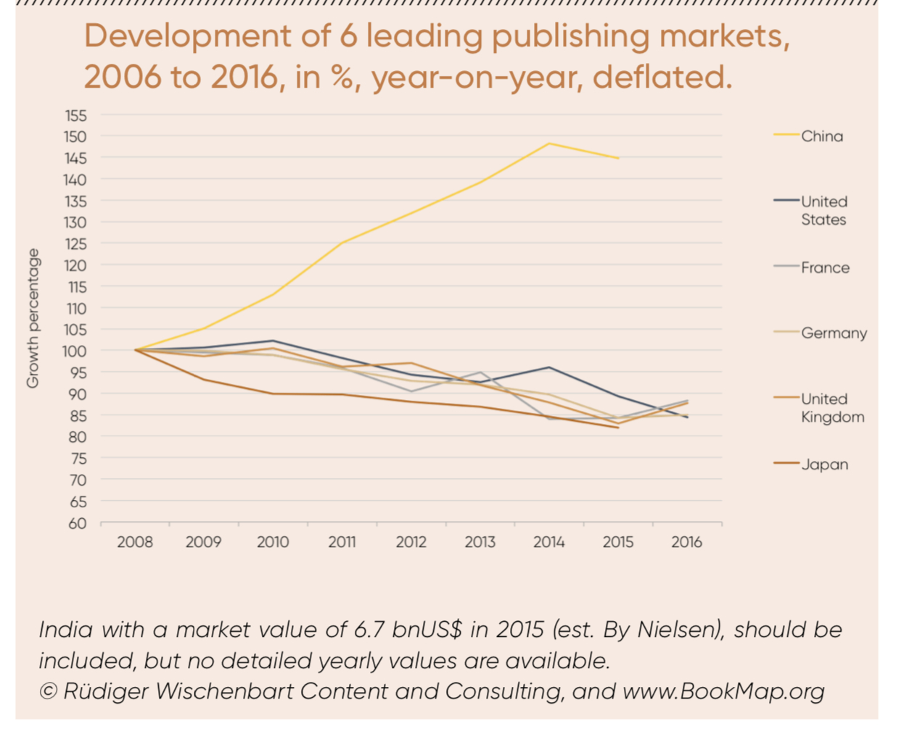](media/68747470733a2f2f7773312e73696e61696d672e636e2f6c617267652f303037394a59385467793166786139786f63666f6a6a3330796d3072797466622e6a7067.)

[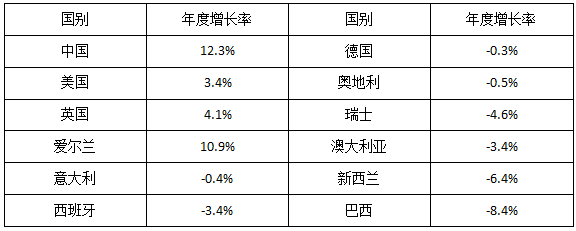](media/687474703a2f2f7777772e6370746f6461792e636e2f61727469636c6566696c652f313533323431393438343335353037343139312e706e67.)

### 3.4 小彩蛋

* 东京是世界上书店最多的城市

* 纸质书并没有死

    从全球数据看，这几年数字出版只占出版业20%的份额，没有一个数字出版的概念股出来。“贝索斯也不怎么说kindle了”。法兰克福书展官方发布了《2017图书商业报告》，报告显示美国的电子书在在经历了2010年到2014年的增长后，已经开始出现负增长，2016年的负增长率甚至达到16%。

## 4.对一家书店的全局认识

### 4.1 从几家头部连锁书店说起

#### 4.1.1 西西弗书店

##### 西西弗书店 时间

* 成立时间：1993年8月
* 里程碑/关键时间节点
    * 成立于1993年8月
    * 1997年10月18日在贵阳、2007年12月在重庆注册为有限责任公司，组成股东会，实行董事会领导下的总经理负责制。
    * 2007年金伟竹开始担任西西弗书店董事长
    * 2008年，西西弗在重庆开出第一家省外2.0概念书店。
    * 2017年1月13日，西西弗在北京蓝色港湾揭幕了北京第一家店
    * 西西弗3.0时代将构建以文化内容为核心的复合平台。
* 营业时间：周一至周日 10：00-22：00

##### 西西弗书店 空间

* 国家：中国
* 独立or连锁 /几家分店：150家分店
* 位置分布：北京11家、上海8家、广州2家、深圳9家、成都9家、天津2家、南京2家、杭州7家、武汉6家、重庆10家、合肥2家、福州3家、南宁2家、贵阳5家、海口1家、郑州2家、哈尔滨6家、长沙2家、南昌2家、长春4家、沈阳4家、济南1家、银川1家、太原2家

* 选址：商圈
    * 由于西西弗书店是区域内的文化聚集载体，西西弗推出的丰富而极具人气的各类文化活动，能为商业综合体带来动态的复合推广效应与文化品牌价值。从而虽然书店的利润偏薄、付租能力相对较弱，但能与真正注重品质体验的商业地产达成利益上的互补共赢。
* 店铺面积：标准店面积大体在500平米左右，旗舰型的大店也就800平。小店占用商业资源少，更受商业体欢迎，也有利于西西弗控制单店成本以提高收益。
* 店内区域：图书销售区、咖啡馆、文创区、儿童区
* 书品陈列面积比：北京西直门凯德店近750平方米的卖场面积中，图书摆放区域有600余平方米，咖啡馆占地近150平方米。图书品种涵盖文学、艺术、社科、生活、少儿，共2.3万多个品种，近5万册藏书。
* 陈列逻辑：专业买手团队打造大众精品阅读，信息化精准定位陈列位置。在商品流控系统的大数据运算下，精准定位到店内的最佳销售点，同时进行快速广泛的周期产品流动，不断维持提高读者新鲜感，吸引客群的周期性消费，确保客群黏度。由于图书商品的最佳陈列位置已由系统自动计算好，西西弗的员工在商品管理上非常轻松。
* 员工人数：400多人
* 线上产品：西西弗公众号；西西弗微博；官网：[http://www.sisyphe.com.cn/](http://www.sisyphe.com.cn/)

##### 西西弗书店 变量

* 客户选择
    * 我们要的是让“少部分已有阅读习惯的人读更好的书”，还是引导“大部分还没有进入深化阅读的人培养阅读习惯、知道读什么书”？我们选择了后者。我们要走大众路线，为大众读者提供有引导性的精品化的图书，让更多的人能够去读不错的书。

* 价值获取
    市场的精准定位决定了西西弗有很高的周转率；选址的专业决定了西西弗有较大的人流基数；而品牌影响力和行业特质决定了西西弗的成本较低。这三者共同促成了西西弗的盈利。

* 战略指数

    * 连锁复制：十年建立标准化快速连锁体系，大数据差异定位商品组合
        * 1. “一切皆可阅读”的设计理念
        * 1. 标准化快速连锁
        * 1. 不同店的差异化商品组合，利用大数据精细定位
        * 1. 不同店的相同标准配型：“矢量咖啡”和“不二生活”
        * 1. 物流：根据业务需求量身定制，自建物流体系
        * 1. 营销：会员制、新媒体营销、文化活动带来高粘性用户
    * 零售领域数字化管理：
        * 从多个维度给每本书打上10多个属性标签，把客群和产品做数据化匹配。然后根据门店所在商圈客群、消费能力等判断一本书值不值被采购，适合放在哪家书店、需要跟什么书摆放在一起。参照对象：泛零售领域：优衣库、星巴克
        * 替代人运作书店的数控模型19个，这套数字化管理方法“让员工从繁复、不稳定的个人判断中解脱出来”，使开店更高效。
        * 通过收集上来的数据，建立消费画像，或者叫消费轨迹模型，以实现精准的复合服务，即文化服务、产品服务和互动服务这三大服务。
        * 我一直强调图书是所有零售业中最难做的产品，因为它有产品非直观化、内容唯一性和SKU密集度高这三大特性，决定了它是最难操作和驾驭的产品。图书不像食品，比如辣椒酱，你不喜欢吃这个还可以买那个，很直接很直观。对于图书，我们要进行多维度多角度的属性归类，赋予它多维度的标签，例如，购买力标签、内容标签、作者标签、出版品牌标签、市场影响力标签等。我们把这些图书标签统称为复合标签。而图书的标签还要不断深挖，等到标签体系精细到能跟读者的个性化阅读需求对接后，通过数据才能看到趋势和属性问题。
    * 追求坪效：把书当成一般商品经营。
* 投融资情况：无资本注入

* 商业定位：参与构成本地精神生活 引导推动大众精品阅读

* 供应链上下游（是否有自己的出版社）:无

* 母公司、子公司

    * 历经二十多年发展旗下拥有Park书店(SisypheParkBooks)、矢量咖啡(UPCoffee)、“不二生活”创意空间(BooartLife)、“七十二阅听课”儿童阅读体验空间(七十二ReadingCall)、《唏嘘》杂志(Much)、推石文化(Twinstone)六个子品牌。
* 关键人物：创始人薛野；现任董事长金伟竹

* 财务情况

    * 西西弗一直保持着盈利状态。截止2017年底，西西弗年营业额5.2亿。西西弗门店年均坪效1.2万，年均周转率1.7次。并且，西西弗要求所有新开门店在短期内达到盈利状态。

#### 4.1.2 言几又书店

##### 言几又 时间

* 成立时间：2006
* 里程碑/关键时间节点
    * 2006年，言几又集团董事长兼CEO但捷大学毕业后，在成都紫荆小区第一家社区书店“今日阅读”，占地100坪。随后几年以“阅读好邻居”形象，
    * 2006年到2009年，相继开了60余家连锁书店。
    * 2013年，受互联网图书市场影响，今日阅读60家连锁书店接连关停。
    * 2014年，今日阅读整体改革，开始进驻购物中心。成都环球中心建立500平空间打造新书店商业形态。今日阅读品牌升级为高端品牌言几又，主打城市文化空间。
    * 2015年，获得包括星瀚资本在内的2600万A轮投资。占地3600平方米的首家言几又标准店在成都凯德天府开业。
* 营业时间：周一至周日 10：00-22：00

##### 空间

* 国家:中国

* 独立or连锁 /几家分店：41家分店 今日阅读18家 22家标准店 1家旗舰店

* 分店位置分布：北京7家、天津3家、上海10家、广州1家、成都6家

    * 言几又（王府井店）：北京市东城区王府井大街269号王府中環F1
    * 言几又（北京荟萃店）：北京市大兴区欣宁街荟聚西红门购物中心3楼
    * 言几又今日阅读（中关村店）：北京市海淀区海淀图书城西大街35号3幢1层，中关村创业大街内
    * 言几又今日阅读（北京五棵松店）：北京市海淀区复兴路69号院2号华熙LIVE.hi-up西区B1层
    * 言几又今日阅读（北京三里屯店）：北京市朝阳区南三里屯路通盈中心1楼
    * 言几又今日阅读（北京官舍店）：北京市朝阳区东方东路19号院5号楼2层
    * 言几又今日阅读（北京龙德广场店）：北京市昌平区立汤路186号龙德广场F4
    * 言几又（天津于家堡店）：天津市滨海新区于家堡金融自贸区堡子里21号
    * 言几又（和平大悦城店）：天津市和平区南京路189号和平大悦城F4
    * 言几又（天津大悦城店）：天津市南开区南门外大街2-6号天津大悦城北区3F层
    * 言几又（上海宝龙城店）：上海市闵行区新镇路1399号七宝宝龙城市广场F1
    * 言几又（上海湖滨道店）：上海市黄浦区湖滨路150号湖滨道购物中心B1
    * 言几又 (上海来福士广场店):上海市长宁区长宁路1139号来福士广场F1
    * 言几又（上海虹桥天地店）：上海市闵行区申长路688号虹桥天地购物中心内
    * 言几又·今日阅读(百联世纪店):上海市浦东新区世纪大道1217号百联世纪购物中心F4
    * 言几又（上海长泰广告店）：上海市浦东新区金科路2889弄长泰广场B座1层
    * 言几又·今日阅读（遵义路店）:上海市长宁区遵义路100号虹桥南丰城F4
    * 言几又·今日阅读（月亮湾店）:上海市虹口区瑞虹路188号瑞虹天地月亮湾F2
    * 言几又（上海万象店）：上海市闵行区吴中路1799号万象城F6
    * 言几又（上海滨江万科中心店）：上海市浦东新区民生路118弄滨江万科店
    * 言几又(广州K11购物艺术中心)：广州市天河区珠江东路6号联讯U谷B栋
    * 言几又·今日阅读：深圳市南山区白石路2168号南山京基·百纳广场B1
    * 言几又·今日阅读：深圳市罗湖区深南东路5016号KKMALL京基·百纳空间F4
    * 言几又(IFS店)：成都市锦江区红星路三段1号IFS国际金融中心B2
    * 言几又（成都凯德天府店）：成都市高新区天仁路388号凯德天府F4
    * 言几又（环球中心店）：成都市武侯区高新区天府大道北段1700号环球购物中心3F
    * 言几又.今日阅读（成都大悦城店）：成都市武侯区大悦路518号大悦城B1
    * 言几又：蛟龙港双楠大道四段双流园区海滨城购物中心三楼
    * 言几又·今日阅读（万达广场店）：成都市青羊区日月大道一段978号万达广场F3
    * 言几又(砂之船奥特莱斯店)：西安市灞桥区世博大道5001号砂之船奥莱F4
    * 言几又（迈科中心旗舰店）：西安市迈科国际一层
    * 言几又·今日阅读（西安金地广场店）：西安市雁塔区曲江池东路999号金地广场F2
    * 言几又·今日阅读（太白印象城店）：显示南二环太白立交西段155号印象城3楼
    * 言几又·今日阅读（熙地港店）：西安市未央区凤城七路8号CITYON熙地港F6
    * 言几又·今日阅读（阳光天地购物中心店）：西安市高新信息大道1号阳光天地购物中心2层
    * 言几又·今日阅读(鑫苑大都汇店)：西安市言几又·今日阅读(鑫苑大都汇店)
    * 言几又（新城吾悦广场）：南京市湖北路吾悦广场4楼
    * 言几又（杭州大悦城店）：莫干山路与隐秀路交叉口杭州大悦城L4
    * 言几又（杭州来福士店）：来福士广场负一层
    * 言几又·今日阅读（重庆时代广场店）：重庆市渝中区邹容路100号重庆时代广场F4
    * 言几又（昆明1903店）：云南省昆明市西山区昆明滇池国家旅游度假区海宏路滇池湖岸花园湖滨商业2栋商铺

    总部：四川言几又文化传播有限公司：四川省成都市武侯区百铭广场B座703

* 选址策略：
    一，最早荟聚这个地方地理位置在北京不算很好，在南四环附近，但是因为这是宜家做的一个综合性购物中心，我们对宜家的品牌是有信心的;

    第二，宜家的消费人群符合言几又人群定位。我们与宜家的客群混合度非常高，这里虽是新兴社区，但周边年轻阶层较多，从近半个月的运营来看，荟聚商圈的品牌带动还是相当有影响力的。

* 店铺面积：标准店超过3000平方米，书籍超过10万册；今日阅读占地800平方米，旗舰店占地面积比标准店更大。

* 员工人数：500-2000人

* 员工薪酬情况

    * 历年招聘职位量变化：2015年19个 2016年32个 2017年123个
    * 薪酬情况：店长5k-9k 店员3k-5k
* 人流量：2016年7月北京大兴西红门荟聚购物中心店，开店当天人流量超过6000人次，周末达上万人次

* 线上产品：言几又安卓客户端 3.7万下载量；公众号「言几又文化」，预估活跃粉丝量19377

##### 变量

* 关键人物：但捷联合创始人兼CEO、袁岳：联合创始人

* 投融资情况：

    融资：

    1、2014年天使轮100万人民币 飞马旅
    2、2015年A轮 2600万人民币 星瀚资本、京东金融、英谊资本
    3、2017年 1.2亿 盛世资本领头、建发集团跟投

    投资：1、2018年投资-会空间：A轮 2000万 。峰瑞资本领投、言几又、清科创投（财务顾问）

* 商业定位：文化复合店。

* 业态：书、咖啡厅、只能家居体验馆、艺术画廊、言宝儿童乐园 言几又成都 IFS：旗舰店店主要分有特色书区、儿童区、产品区、咖啡区、收银区、玻璃中庭及演讲区等 7 大区域。

* 财务情况：

    * 成本：经营成本比较低——在一线城市的大型商业地产里，言几又的租金大约是其他品牌商的20%左右，在很多二线城市甚至是免费的。对方主动邀请言几又直接进驻。
    * 收入：
        * 零售-书：言几又的书籍部分占整个店面销售额的 40%。而通过复合业态，书店实现销量逐年递增，与以往相比，现今每年实现的总销售量是过去的 5 到 6 倍， 甚至能达到过去的 10 倍。 北京荟聚店月销售图书达到上百万
        * 零售-咖啡：咖啡销售在二三十万左右。
        * 零售：目前言几又绝大多数店的经营状况都非常好。它可以获利的SKU比较多，包括了书、餐饮和小餐食、小商品销售、艺术品展区还有一些发布会活动类的收入。
        * 会员：从它提供的数据来看，目前中关村店半年新增会员1858人，会员消费贡献率45.6%。已经初步看到了会员制 带给言几又线下店的价值。
        * 单店经历3-6个月后的培育期可以盈利，虽然整体因总部管理成本和固定资产折旧仍亏损，90%的单店已经处于盈利状态。
    * 盈利模式：零售+活动+场地+店中店+外卖送书+资本进驻
        我们的盈利模式很简单。一种，就是零售的方式，零售就是卖货，赚差价。另一种，就是我们结合那么多店，跟这些品牌有一个利益分享模式。第三种，言几又都是会员制，我们跟会员有很多精准营销的模式。第四种，我们有很多的非营销模式，比如体验、互动性产品、教育性的产品等。

* 战略指数
    * 店中店，成为甲方
    * 资本注入
    * 品牌效应降低成本

#### 4.1.3 先锋书店

##### 时间

* 成立时间:1996

* 里程碑/关键时间节点:

    * 1996年11月26日，先锋书店诞生于太平南路圣保罗教堂对面，面积约17平方米。不到一年，房子拆迁了，先锋被迫搬到了马府街7号，一个14平方米的小住宅楼，读者找不着地方，生意一片萧条，钱晓华笑对人生。
    * 1999年7月，先锋从太平南路搬到了广州路79号儿童医院旁二楼，97平方米，据说窗前有一排座位,这是“先锋书店广州路南大老店”。
    * 2001年9月，先锋书店搬到了广州路12号二楼，面积约600平方米。这就是很多读者怀念着的先锋书店广州路南大店，也是先锋真正的转折，算是发展阶段。
    * 2002年11月20日，先锋书店东方商城店开业，300平方米，在新街口地铁出口，计划成为南京第一家地铁书店。然而本该经过此店的地铁改线了，人流量得不到保证，东方商城店就此落寞，最终于2006年停业。
    * 2003年4月，先锋书店夫子庙店开张。夫子庙店，人称“先锋大道，阅读广场”，160米长，12米宽，2000平方米的地下大街，是中国最长的书店。这里是钱晓华意外中的邂逅，是他魂牵梦萦的地方。
    * 2004年9月18日，先锋书店五台山旗舰店开业，经营面积近3680平方米，经营品种7万多种，并设立了1000平方米的物流配送中心。先锋书店五台山旗舰店曾被美国有线电视新闻网（CNN）称为“中国最美书店”，曾被英国广播公司(BBC)评为全球十大最美书店之一。五台山主要商店拥有让读者分享他们对书籍、电影和艺术的看法的空间。 这里还有很多种艺术展览和书籍发布会。书店不是出售图书，而是为读者提供了一个开放的场所，让读者可以进行讨论和分享。书店为读者提供沙发、座椅,让读者可以免费看书。有咖啡馆。
    * 2006年1月26日，先锋书店龙江店开业，这是先锋书店的第一家社区店，经营面积约600平方米。
    * 2011年7月23日，先锋文史书店开业。经营面积约100平方米，位于总统府大院内，主营创意产品和民国、南京、近现代史等题材的图书，店面小而精致，广受好评。
    * 2011年11月25日，先锋书店广电城店开业。2012年11月30日结束营业。
    * 2012年4月21日，先锋书店无锡惠山店正式开业，先锋书店首次跨出南京。800平方米，位于无锡惠山古镇绣嶂街9号、34号，两幢古色古香的店面隔街相望。
    * 2013年9月9日，位于总统府西花园的夕佳楼内，总统府民国书院于静美开张，面积100平方米。
    * 2013年10月1日，美龄宫店正式开门揖客，坐落于钟山风景区中山陵9号美龄宫内，依山而筑，绿树掩映之中的中西合璧式建筑，以中国式大建筑古典民族风格赢得了最美民国建筑之一的称号。2018年9月30日停业
    * 2013年11月6日，南京博物院先锋书店新生活书局开业。
    * 2014年10月13日，先锋书店润泽书局开业。
    * 2014年4月15日，安徽黟县先锋书店碧山书局开业。
    * 2015年10月24日，南京先锋书店的第11家分店“云夕图书馆”正式开张。这座吐纳于云夕之间的图书馆，位于海拔600多米的桐庐县莪山乡新丰民族村戴家山，隐匿于一片黄泥房中。
* 营业时间:
    周一至周四   10：00-21：00；周五10：00-22：00；周六至周日 9：30-22：00
 云夕： [周一 ~ 周日] 09:00 a.m. - 18:00 p.m.
    美龄：09:00 a.m. - 17:00 p.m.2018年9月30日停业
    润泽： [周一 ~ 周日] 10:00 a.m. - 20:00 p.m.

##### 空间

* 国家：中国

* 位置分布

    * 江苏南京：

        （1）五台山总店 地址：南京市鼓楼区广州路173号（古南都饭店对面）

        （2）永丰诗舍 地址：南京市玄武区中山陵3号永丰社

        （3）总统府文史书店 地址：南京市玄武区长江路292号总统府院内

        （4）总统府民国书院 地址：南京市玄武区长江路292号总统府夕佳楼

        （5）美龄宫文史书店 地址：南京市玄武区中山陵9号美龄宫

        （6）新生活书局 地址：南京市玄武区中山东路321号南京博物院民国馆

        （7）润泽书局 地址：南京市浦口区江浦街道雨山西路86号南审浚园

        （8）颐和书馆 地址：南京市鼓楼区江苏路39号

        （9）骏惠书屋 地址：南京市秦淮区老门东历史文化街区边营2号

        （10）老钱工作室 地址：南京市鼓楼区广州路189号民防大厦1005
        江苏无锡：

    * 惠山书局 地址：无锡市梁溪区惠山古镇绣嶂街34号
        安徽黟县：

    * 碧山书局/牛圈咖啡馆 地址：安徽省黄山市黟县碧阳镇碧山村启泰堂
        浙江桐庐：

    * 云夕图书馆 地址：浙江省桐庐县莪山畲族乡戴家山7号


* 独立or连锁 /几家分店:13家分店 南京10、无锡1、安徽黟县1、浙江桐庐县1

* 选址：目前总计开店13家，最近几年新店都开在具有人文浓郁人文色彩的旅游区。

* 店铺面积

    * 1.夫子庙店：2000
    * 2.五台山总店：3680
    * 3.龙江社区店：600
    * 4.文史书店：100
    * 5.无锡惠山店：800
    * 6.民国书院：100
    * 7.美龄宫店：关门
    * 8.博物院新生活：
    * 9.润泽书局：1000
    * 10.碧山书局：
    * 11.云夕图书馆:150
    * 12.永丰诗舍：
    * 13.颐和书馆：150
    * 14.骏惠书屋：
* 陈列逻辑:
    7.美龄宫店：根据多年来收藏的珍贵历史资料加工、生产、制作出系列文化创意产品。如民国风情套装明信片、相册、笔记本及民国人物徽章、美人镜等，同时全面呈现以南京为主题的手绘创意地图，民国主题海报、木制雕刻书签和民国时期人物木刻版画，重现民国时期的历史风采和原貌。
8.博物院新生活：
9.润泽书局：开始探索书店进驻大学的新模式。由先锋阅读馆、润泽大讲堂、先锋创意馆和咖啡体验馆这4个场馆组成。
10.碧山书局：
11.云夕图书馆:一幢为艺术咖啡馆，一幢为图书馆和活动空间。

* 线上产品：淘宝店 [https://xfsd1996.taobao.com/](https://xfsd1996.taobao.com/) 淘宝店销售额可以整理；公众号「南京先锋书店」预估活跃粉丝：30346；微博「南京先锋书店」，粉丝：37w；微店：「南京先锋书店」

* 变量

* 关键人物：创始人：钱晓华；副总经理黄健明
* 外界评价:2009年度获得书业“中国最美书店”之美誉，2010年获得华语世界“最具影响力人文书店”称号；2012年先锋书店获选为《金陵晚报》1993-2012年南京20年新地标。2013年9月，美国cnn专题报道“中国最美书店开在地下停车场”。每年有来自美国、英国、丹麦、澳大利亚、意大利、加拿大、荷兰等世界15个国家的出版商访华团到先锋书店考察交流。先锋书店五台山旗舰店曾被美国有线电视新闻网（CNN）称为“中国最美书店”，曾被英国广播公司(BBC)评为全球十大最美书店之一。
* 投融资情况：无资本注入
* 商业定位:秉承开放、独立、自由、人文的经营理念，深耕阅读，现已发展成为国内知名的民营学术书店，其为读者打造的建筑之元素、宗教之情结、人文之关怀的精神内涵和诗意之美的书店阅读体验空间，吸引了众多国内外读者的聚集，使其成为南京重要的文化地标和城市公共客厅。
* 业态:
* 商业模式：
* 财务情况

* 盈利模式

    * 零售：书、优品
        先锋碧山游学活动（11月17日-11月18日）￥780.00-1800.00

    【雪卡】会员卡：￥899 此卡为固定面值，充值899元，卡内面值999元；凭此卡可至先锋任意门店免费拍摄婚纱照一次，

    贵宾会员卡：￥333 ￥555 ￥888 ￥2353 ￥6250 ￥1111

    一次性充值300元而不满2000元的顾客，可以享受9折优惠；一次性充值2000元而不满5000元的顾客，可以享受8.5折优惠；一次性充值5000元而不满20000元的顾客，可以享受8折优惠；一次性充值20000元及以上的顾客，可以享受7.5折优惠；

    * 战略指数

### 4.1.4 茑屋书店

* 时间

* 成立时间:1983
* 里程碑/关键时间节点:
    * 1、1985年成立CCC（Culture Convenience Club)，把书籍、音乐唱片、录像带放到一起卖。让租赁成为生活提案。 - 2、1999年，开始了在线生活内容发布服务 TSUAYA ONLINE
    * 3、2002年上线了影音碟片线上租赁服务，截止2015年，会员数超过160万人。
    * 4、2003年，引入星巴克
    * 5、2003年10月推出共通积分业务
* 时代背景:
    * 1、美国西海岸文海在日本盛行，日本憧憬欧美生活方式，而电影就是呈现各种生活方式的软性渠道 - 2、日本街头时尚与生活方式的发展史：20世界60年代末，日本时尚潮流都还处于一元化时代——当时正好是出生于40年代末期的“团块一代”走入社会的时候。他们的成长期里，物质生活并不丰裕，还处于憧憬美国生活方式的时代。 进入20世纪90年代，这群人逐渐手头丰裕起来，虽然经历了泡沫经济破灭的不景气状态，但仍然属于“时间和金钱都具备的一代” 等到他们的孩子出生——出生在20世纪70年代前期的“小团块”一代，在日本街头时尚潮流史上也是推崇“编辑感”的一群人，他们拥有物质富裕的生长环境，有自己的坚持是其特征。 出现更有主见和多元化的新中产们，比起现如今更想追求自我的人群，为他们提供“编辑好，适合自己的内容”，恰好复合这个人群的微妙需求
* 营业时间

* 空间

* 国家
* 位置分布
* 独立or连锁 /几家分店：1400家门店
* 选址
* 店铺面积
* 店内区域
* 书品陈列面积比
* 陈列逻辑:按照需求场景堆砌出一个个独立空间——比如某个季节的料理主题，那么在这个堆头周边，不仅有与此主题相关的料理书，甚至会出现厨具，以及合作商铺提供的各类食品。而茑屋书店转变为“买场”思路，不再按照书的形态，而是按照书的内容分类，重构了书店空间。不管是文库本、单行本还是杂志，只要内容相关的，都经过筛选后放在一起。这样的模式改变了茑屋与图书批发商的合作方式，整个书店只有12%的书与普通书店相同。
* 员工人数
* 人流量
* 线上产品

* 变量

* 关键人物:创始人：增田宗昭

* 外界评价

* 投融资情况

* 商业定位

* 业态

* 商业模式:
    1、为顾客提供生活提案的能力：把店铺选择的好东西推荐给顾客——编辑能力 用茑屋书店创始人增田宗昭的话说“传统书店的问题就在于它们卖书”，茑屋书店本质上是创造一个让人度过一段美妙时间的场所，并且在这个过程中给大家推荐最好的生活方式（比如值得推荐的旅行目的地），所以增田宗昭说这是“买场”。
    2、有书店的街道：茑屋书店内设置了杂志长廊，在全球视野内持续更新各类杂志。杂志更新频率高于书籍。
    3、T point共通积分业务，截止2018年3月底，已经有6647万用户，超过日本总人口的一般。与电信公司Softbank、全家便利店在内的182家公司，超过82.5万家不同业态店铺合作，结成了广泛的商业联盟。通过这些积分数据，它得以归纳出联盟内消费顾客的消费行为与群体肖像。

* 财务情况
    收入：每月营业额上亿日元（相当于600多万人民币）
    茑屋书店的盈利，20%来自图书音像制品的销售，80%来自于特许经营业务。CCC并非是一家重资产的实体企业，而一家拥有大数据的轻资产策划公司。

    * 盈利模式
    * T - travel 旅游中介服务，如果客人在书中看到哪个地方心动想去的话，也可以在这里咨询，来一场说走就走的旅行。
    * Tsutaya Book Apartment:24小时营业的公寓式书店 房间：500日元/小时 淋浴间：500日元/次 地址：东京都新宿区新宿3-26-14 Minimubiru 4-6F
    * CCC:数据驱动的咨询公司 c to s to b
    * 战略指数
    * 战略的壁垒在于数据

    客户选择价值获取战略控制业务范围，《知的资本论》他把顾客的购物诉求分为即时性、直接性和舒适性三种，由此对应三种零售业态。

#### 4.1.5 亚马逊线下书店

* 选址：纽约、芝加哥、硅谷等人口密集的城市或地区
* 商品：书、电子产品、其他非书小商品
* 选书方式：数据与算法
* 陈列逻辑：1、书籍与电器分区，留出阅读区 2、书籍封面朝向消费者 3、摘取线上用户评语展示 4、根据数据做出书籍细致分类 5、列出“猜你喜欢”相关书籍 6、黄金区域留给电子产品
* 支付逻辑：亚马逊线上实时价格查询；Amazon Prime 会员优惠 ；同时支持线上线下支付
* 运营目的：获得新会员用户；让已有用户贡献新的数据；完善用户画像；获得广告收入。

### 4.2 不忍错过的独立书店

* 4.2.1 两本书店
* 4.2.2 万圣书园
* 4.2.3 莎士比亚书店
* 4.2.4 博尔赫斯书店

### 4.3 如何建立对一家书店的全局认识

* 时间：

    成立时间、时代背景、里程碑、营业时间

* 空间：

    国家、独立or连锁（几家分店）、位置、选址策略、店铺面积、店内区域、书品陈列面积比、陈列逻辑、选品逻辑、员工人数、员工待遇、线上产品

* 变量：

    客户选择、业务范围、价值获取、战略指数、投融资情况、商业定位、供应链上下游（是否有自己的出版社）、财务情况

* 关键指标：营业额、坪效、周转率、复购率、人流量、会员数、活跃会员数

## 5.书店的盈利模式和战略指数

### 5.1 书店有哪些盈利模式？

#### 成本

* 租金、人力、装修、进书、非书产品成本、水电费、活动费、品牌宣传费

#### 赢利点

* to c

    * 零售：书、饮品食品、文创周边、储值卡、其他零售业态
    * 租赁：空间场地、书
    * 会员制：会员费
    * 活动费
    * 入门门票——春风习习杂志社
* to B

    * 软件服务：制作进销存平台
    * 会员数据
    * 中介咨询
    * 活动场地
    * 广告费（线上产品 线下门店）
    * 招商出租摊位
* 前店后社

    * 生活.读书.新知三联书店
    * 中华书局
    * 中信出版社
    * 小众书坊
    * 正阳书局

### 5.2 书店有哪些战略指数

1、低成本——品牌效益降低租金、连锁复制降低装修和人力运营成本

2、数据壁垒：消费数据、用户数据

3、控制上下游：从书店开到出版社，自产自销。

4、品牌效应

5、连锁复制、连锁不复制、不连锁不复制

### 5.3 洞察发现：开书店的机会在哪里

* 不做购物中心的书店大卖场，做社区读书俱乐部
    * 购物中心vs社区——消费者任务场景不同：在购物中心逛街时，用户处于短期享乐状态，渴望立刻享受，缺乏规划和理智。而卖书行为看书行为时偏向长期自律的行为，充满规划和理智能够延迟满足。购物中心虽然流量大，但是买书不是当下用户面对的任务，因此不同不得不增大非书产品比例；而开在社区店虽然辐射范围有限，却可以强化读书任务场景和距离优势从而增加进店频率。
    * 越开越大的大店vs小店——在零售行业演化过程中有个趋势：一线城市业态越来越小型化，低线级城市业态越来越大型化。在人口少的地方要搞大，一些没见过的大型业态能吸引巨大的流量；一线城市的消费者什么都见过，就越做越精细，所以小业态在高线级城市反而会流行，小到一个茶饮店、一个鸭脖店都可以产生很大的商业价值和商业机会。
    * 书店大卖场vs读书俱乐部：不靠买书赚钱不等于不做书的生意。大家都知道卖书不赚钱，于是纷纷开始卖别的东西。卖着卖着书店仅有两成占比是书，我觉得这不算是书店而是大卖场。卖书不赚钱，但其实还应该有很多围绕“读书”行为做的服务。比如在纸质书开始变贵的趋势下，开始借书；比如不和电商买书行为做竞争，而是提供读书的场景和空间；比如针对个人兴趣和成长阶段做个性化荐书
    * 用户成为会员还不够，要成为好朋友、好邻居：大卖场来一个人走了，店家对他的了解能有多少呢？用数据建立壁垒的重点不仅在于“大数据”，更在于“深度数据”，而深度数据是建立在深入的情感连接基础上的。不是盯着表格中的一行行数字，而是当面和会员相熟认识变成朋友甚至变成合作伙伴。建立在情感连接基础上的用户数据，是强的用户粘性和最牢固的壁垒。

## 6.报告的结尾

### 6.1 插入一个硬广——「一个书店」

「一个书店」定位——自家楼下的另一个书房

* 会员制：全天仅对会员开放，每月赠饮。
* 精选好书借阅为主，卖书为辅
* 每天都有文化活动，给会员带来好作品和读书机会
* 线上小程序，下线收集店内用户行为数据，有人请味的无人店。
* 开店整三个月，和会员建立了非常强的情感连接，不仅彼此成为朋友、会员自助看店，还有四位会员成为兼职同学，参与开发、设计等工作

[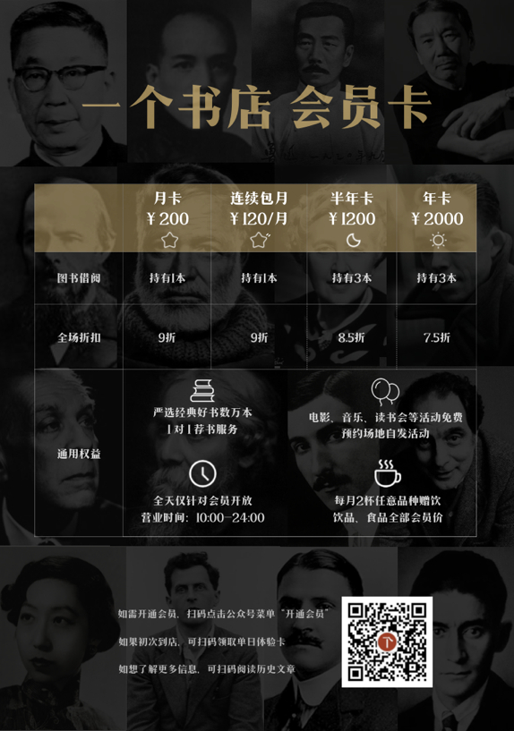](media/68747470733a2f2f7773312e73696e61696d672e636e2f6c617267652f303037394a59385467793166786238623261696d6f6a33306679306d70746c362e6a7067.)
[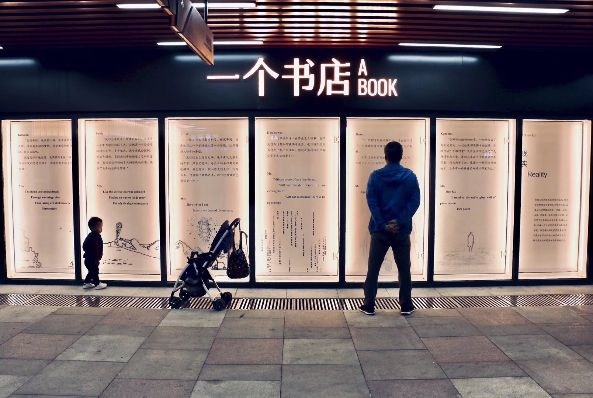](media/68747470733a2f2f7773312e73696e61696d672e636e2f6c617267652f303037394a59385467793166786239756f7a6d64676a3331386f3074793133742e6a7067.)
[](media/68747470733a2f2f7773312e73696e61696d672e636e2f6c617267652f303037394a5938546779316678623975716c61736e6a333079753074793739352e6a7067.)

### 6.2 心得与收获

游离之人 未必迷路

### 6.3 商业与情怀

情怀：书店是一个暗号
商业：书店不能好好赚钱吗
举例：杭州言几又旗舰店vs两本书店

### 6.4 如果你也想有朝一日开一个书店

如果你也想有朝一日开一个书店，希望这个不太成熟的全局报告能对你有点帮助。
下面送你两个小彩蛋——开书店工具：

* [开书店工具箱](https://github.com/ZhangCici/BOOKBP-AI002/issues/4) （持续更新）
* [开书店问题清单](https://github.com/ZhangCici/BOOKBP-AI002/issues/7)（持续更新）
* [开书店的书以及纪录片](https://github.com/ZhangCici/BOOKBP-AI002/issues/8)（持续更新）

但是如果你真的很想开一个书店，以上信息都可忽略，就直接去开吧！那个属于你自己的书店里，有你想要的和未曾想到的一切。

